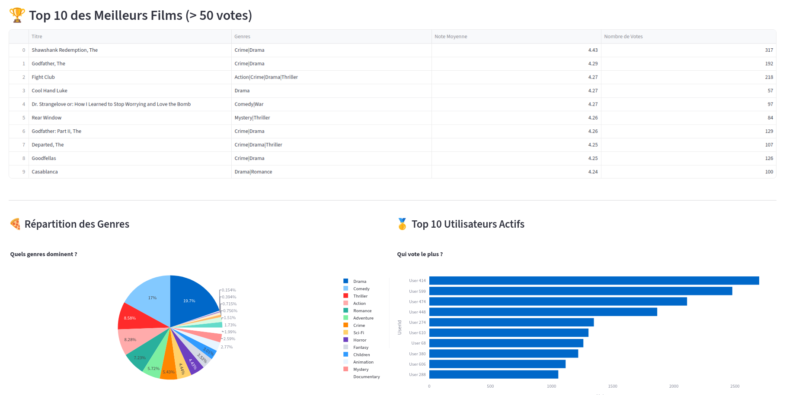

# Projet Big Data : Cinema Trends (Hadoop, Hive & NLP)

**Étudiant :** Bademba SANGARE
**Formation :** M1 Informatique & Big Data - Université Paris 8
**Module :** Cadre Logiciel pour le Big Data
**Date de rendu :** 05 Janvier 2026

---

## Description du Projet

Ce projet a été réalisé dans le cadre du module "Cadre Logiciel pour le Big Data". Il consiste à développer une architecture distribuée répondant à un besoin réel d'analyse de tendances (inspiré des "Recaps" YouTube/Spotify). L'application traite le dataset MovieLens enrichi via l'API TMDB pour fournir des statistiques et un moteur de recommandation de films basé sur le contenu (NLP).

## Accès au Projet (Déployé sur le Cloud)

L'application est actuellement hébergée et fonctionnelle sur le cluster GCP. Aucune installation n'est nécessaire pour la tester.

* **Application en ligne (Dashboard) :** `http://34.121.158.103:8501/`
* **Vidéo de démonstration :** `https://www.youtube.com/watch?v=Y4SRKIWIckA`
* **Dépôt GitHub (Code source) :** `https://github.com/badembafr/projet_hadoop_cinema_trends_nlp_sangare`

## Conformité avec le Sujet

Ce projet répond à l'ensemble des critères demandés :

1. **Besoin réel :** Analyse de tendances et système de recommandation (Cinema Trends).
2. **Technologies Hadoop :** Utilisation complète de la stack :

   * **HDFS :** Stockage distribué des données CSV et enrichies.
   * **YARN :** Gestion des ressources du cluster.
   * **MapReduce :** Traitement via les jobs lancés par Hive.
   * **Hive :** Brique analytique pour les aggregations et KPIs.
3. **Cluster Réel (Cloud) :** Déploiement sur Google Cloud Platform (Compute Engine) avec 3 nœuds (1 Master, 2 Slaves).
4. **Analyse & IA :** Scripts HiveQL pour les statistiques et Python (Scikit-learn) pour la partie NLP.

## Contenu du Livrable

L'archive ZIP est structurée pour répondre aux attendus du rendu Moodle :

```
projet_hadoop_cinema_trends_nlp_sangare/
|
|-- 1_Rapport_Video-lien_Presentation/
|   |-- LIEN_VIDEO_YOUTUBE.txt
|   |-- miniature_video_youtube.png
|   |-- Presentation_Projet_Cinema_Trends_SANGARE.pdf
|   |-- Rapport_Projet_Cinema_Trends_SANGARE.pdf
|
|-- 2_Code_Source_data-hive-python-dashboard/
|   |-- 00_Donnees_Brutes/
|   |   |-- descriptions_api_tmdb.csv
|   |   |-- links.csv
|   |   |-- movies.csv
|   |   |-- ratings.csv
|   |
|   |-- 01_Enrichissement_Donnees/
|   |   |-- descriptions_api_tmdb.csv
|   |   |-- links.csv
|   |   |-- mapper.py
|   |   |-- requirements.txt
|   |   |-- tmdb_scraper_descriptions.py
|   |
|   |-- 02_Hive_MapReduce/
|   |   |-- requetes_analyse.hql
|   |
|   |-- 03_Dashboard_Streamlit/
|   |   |-- dashboard_tendances_movies_nlp.py
|   |   |-- requirements.txt
|
|-- 3_Captures_Execution_Requete_Hive/
    |-- 10_reussite_dl_yarn_slave1.png
    |-- 13_map_reduce_mapper_movies.png
    |-- 16_dashboard_web.png
    |-- 17_les_3_instances_hadoop_gcp.png
    |-- ... (Autres captures d'ecran configuration/execution)
```

## Note sur l'Architecture Technique

Le Dashboard Streamlit (Python) exécuté sur le nœud Master agit comme une interface de visualisation. Il consomme exclusivement les résultats agrégés produits par les traitements Hive et MapReduce stockés dans HDFS.

---


<p align="center">
  
</p>
